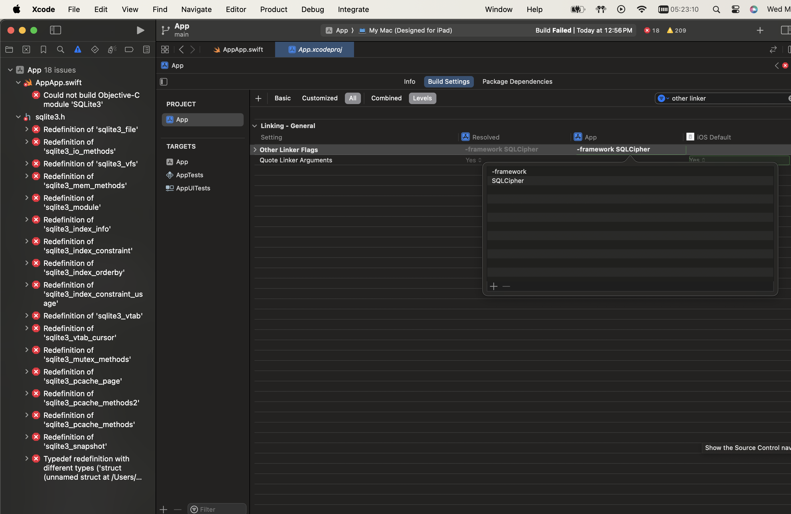
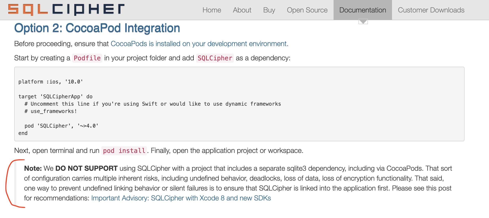

# Adobe Mobile SDK & SQLCipher Issue Reproduction

A example iOS project that reproduces an iOS build error when using [Adobe Experience Platform Mobile SDKs](https://github.com/adobe/aepsdk-core-ios) and [SQLCipher](https://www.zetetic.net/sqlcipher/sqlcipher-ios/) together in the same iOS project. Many attempts at the [solution suggested here](https://discuss.zetetic.net/t/important-advisory-sqlcipher-with-xcode-8-and-new-sdks/1688) have not worked.

Summary of the problem is [this line of code](https://github.com/adobe/aepsdk-core-ios/blob/4.2.3/AEPServices/Sources/dataqueue/SQLiteWrapper.swift#L14) in Adobe's `AEPServices` library causes the `Redefinition of 'sqlite3_file'` error.

The solution [explained here](https://www.zetetic.net/sqlcipher/ios-tutorial/#option-2-cocoapod-integration) has not worked.

# SQLCipher Disclaimer

